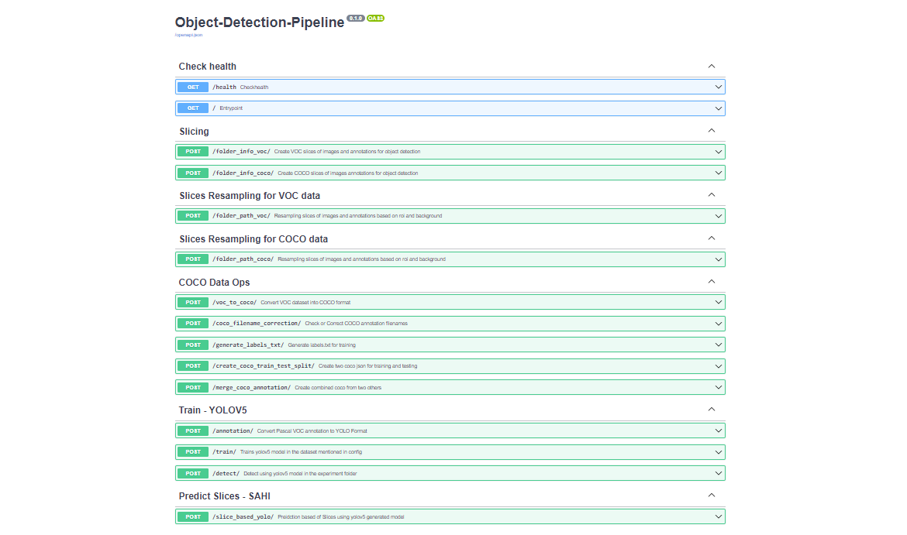

# Object-Detection-Workflow

This pipeline can be utilised for object detection usecases.

## Dataset
### Coastal Litter
1. https://siemensapc-my.sharepoint.com/:f:/g/personal/rishabh_balaiwar_siemens_com/EupGzSjWnNFOuCgpdm8PP9UBEVW081rwqSgUAahwXsblJw?e=ccPUR4
2. https://siemensapc-my.sharepoint.com/:f:/g/personal/rishabh_balaiwar_siemens_com/EjTm0fmA4ahJsyCIZ4mYHPcB2ljxHyhmcG5CSpdL4gWH4w?e=k9znj0
3. https://siemensapc-my.sharepoint.com/:f:/g/personal/vibhav_kulavmode_siemens_com/Ehjaks4asMlKrOTE-6xGtXABJhvC9z1aoaMy9jxJxfoMUg?e=kGH5yw

### Unwetted Trucks
1. https://siemensapc.sharepoint.com/:f:/t/Falcon-XAIteam/Ej89EANP7U9MgDTU8szKhAgBvQo28ZzguyM0KvI_Rf5NXQ?e=mNqbR0

### Equiptments
1. https://siemensapc.sharepoint.com/:f:/t/Falcon-XAIteam/EjZ90egcaTJGvXmL0B8JgCYB2KgIS-KbygxBiYBO3sIQbw?e=yrg4lF

## Current Features
### AI Features
- [x] Image and Bbox slicing along with annotations
- [x] Image with and without ROI sampling along with annotations
- [x] Annotation fromat conversion from Pascal to VOC
- [x] Yolov5 model with all its variances, tensorboard and end to end logging
- [x] Object detection inference using SAHI
### Ops Features
- [x] Model and Experiment versioning
- [x] Dataset versioning (primary)
- [x] REST Apis created
- [x] Separate modules for each functionality
- [x] Yaml files for configuration setup

## Upcoming Features
### AI Features
- [x] Adding experiment name in Yolov5 for training
- Quantised / Onnx model export feature
- Enable detect endpoint of Yolov5
- auto suggestion of region of overlap selection based on data for slicing
### Ops Features
- [x] Enable MLFlow logging
- Adding time for each requests
- Test cases creation
- Exception handling
- Dockerfile creation
- Continuous Integration testing

## In future
### AI Features
- label studio automated annotation Support
- integration with other object detection models
- Extending pipeline for segmentation use cases
- RetinaNet model integration with resnet/mobilenet backbones

### Ops Features
- auto generation of prediction scripts
- auto generation of prediction Apis
- auto docker container generation and export
- logging and versioning of annotations
- Background processes Support
- Database Sqlite/Postgres Support

## Installation
- Create a separate environment
- Install dependencies mentioned in requirements.txt

## Usage
- Goto project folder and launch python environment
- local_start.bat
- Open the website followed by /docs

## Author
- Bijon Guha

## Project status
Active
